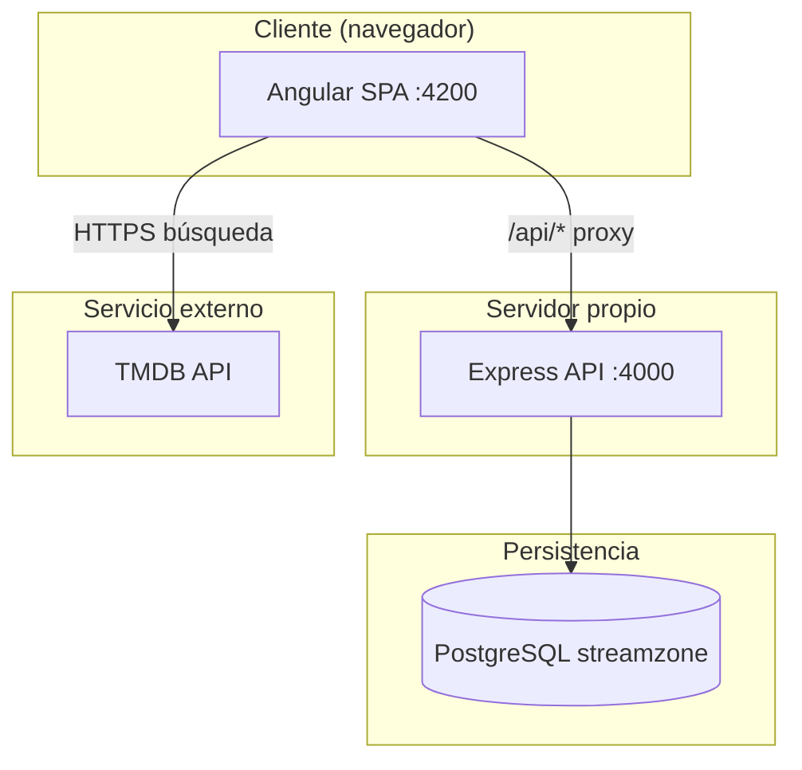
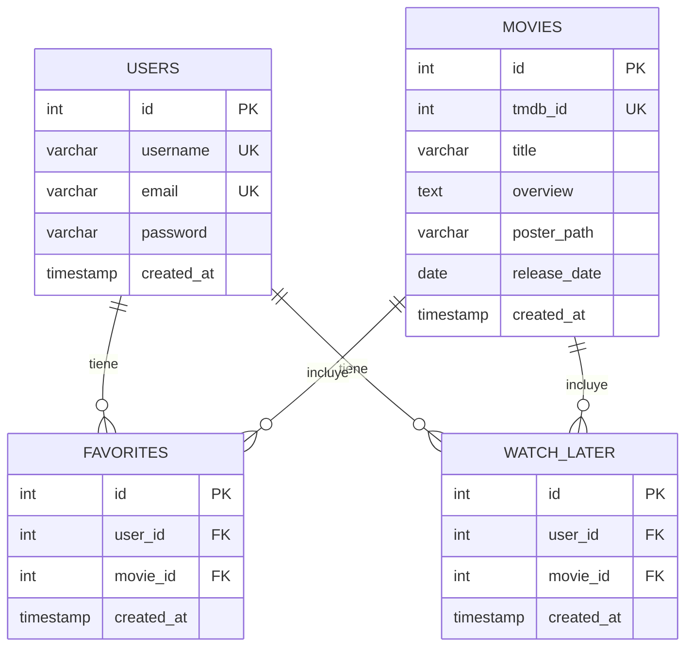

# StreamZone — Borrador de memoria del TFG

> **Documento:** borrador estructurado para la memoria escrita del Trabajo de Fin de Grado.  
> **Proyecto:** StreamZone — plataforma web estilo streaming.  
> **Alumno/a:** [Nombre y apellidos]  
> **Centro:** [Nombre del centro educativo]  
> **Ciclo:** [DAM / DAW]  
> **Curso académico:** [AAAA-AAAA]  
> **Tutor/a:** [Nombre del tutor — completar]  
> **Fecha:** [Mes AAAA]

---

## Índice

1. [Introducción](#1-introducción)  
2. [Objetivo general del proyecto](#2-objetivo-general-del-proyecto)  
3. [Objetivos específicos](#3-objetivos-específicos)  
4. [Contexto actual](#4-contexto-actual)  
5. [Análisis de requisitos](#5-análisis-de-requisitos)  
6. [Diseño de la aplicación](#6-diseño-de-la-aplicación)  
7. [Desarrollo de la aplicación](#7-desarrollo-de-la-aplicación)  
8. [Planificación del proyecto](#8-planificación-del-proyecto)  
9. [Pruebas y validación](#9-pruebas-y-validación)  
10. [Relación del proyecto con los módulos del ciclo](#10-relación-del-proyecto-con-los-módulos-del-ciclo)  
11. [Conclusiones](#11-conclusiones)  
12. [Proyectos futuros](#12-proyectos-futuros)  
13. [Bibliografía / Webgrafía](#13-bibliografíawebgrafía)  
14. [Anexos](#14-anexos)

---

## 1. Introducción

### 1.1 Descripción y contexto del proyecto

**StreamZone** es una aplicación web inspirada en plataformas de streaming que permite a los usuarios explorar películas, realizar búsquedas, iniciar sesión y gestionar listas personales (favoritos y “ver más tarde”). El proyecto se ha desarrollado en el marco del Trabajo de Fin de Grado del ciclo formativo de grado superior en desarrollo de aplicaciones web.

El sistema se compone de tres piezas principales:

1. **Cliente web (Angular)** — interfaz de usuario en el navegador.  
2. **Servidor de aplicaciones (Node.js + Express)** — API REST que centraliza la lógica de negocio.  
3. **Base de datos (PostgreSQL)** — persistencia de usuarios, películas guardadas y relaciones.

Además, se integra la **API de The Movie Database (TMDB)** como fuente externa de metadatos y búsqueda de películas, sin duplicar en la base de datos propia todo el catálogo mundial, sino solo las películas que el usuario decide guardar.

### 1.2 Motivación del proyecto

La motivación surge de la necesidad de demostrar, de forma integrada, competencias técnicas adquiridas durante el ciclo: diseño de interfaces, programación cliente y servidor, modelado de datos, consumo de APIs REST y validación de software.

Las plataformas de streaming han popularizado patrones de interacción (catálogo visual, búsqueda, listas personales) que resultan familiares para el usuario y pedagogicamente útiles para ilustrar arquitecturas modernas.

### 1.3 Beneficios esperados

| Beneficio | Descripción |
|-----------|-------------|
| **Formativo** | Integración real de frontend, backend y base de datos en un mismo producto. |
| **Técnico** | Separación de responsabilidades: TMDB para consulta; PostgreSQL para datos del usuario. |
| **Profesional** | Stack alineado con el mercado laboral (JavaScript/TypeScript full-stack). |
| **Escalable** | Base preparada para añadir autenticación JWT, registro en UI o despliegue en la nube. |

---

## 2. Objetivo general del proyecto

Desarrollar una aplicación web full-stack funcional denominada **StreamZone** que permita a los usuarios autenticarse, consultar películas mediante TMDB y gestionar favoritos y listas “ver más tarde” persistidas en PostgreSQL, mediante una arquitectura cliente-servidor clara y documentada.

---

## 3. Objetivos específicos

1. Diseñar e implementar una interfaz de usuario responsive con **Angular** (componentes standalone, routing, guards).  
2. Desarrollar una **API REST** con **Express** que exponga operaciones CRUD sobre usuarios, películas, favoritos y ver más tarde.  
3. Modelar e implementar una base de datos **PostgreSQL** relacional con integridad referencial.  
4. Integrar la **API TMDB** para búsqueda y visualización de películas en tiempo real.  
5. Configurar comunicación frontend-backend mediante **proxy de desarrollo** y rutas relativas `/api`.  
6. Documentar instalación, pruebas y arquitectura para facilitar la defensa oral del TFG.  
7. Validar el sistema mediante pruebas funcionales e integración (véase [PRUEBAS.md](../PRUEBAS.md)).

---

## 4. Contexto actual

### Situación previa al proyecto

Inicialmente, el frontend Angular funcionaba con datos locales (`localStorage`, ficheros JSON) y un servidor SSR con endpoints legacy. No existía persistencia centralizada ni API propia orientada a PostgreSQL.

### Situación tras el desarrollo por fases

| Fase | Entregable |
|------|------------|
| 1 | Backend base Express + health check |
| 2 | Esquema SQL y datos de prueba |
| 3 | Registro y login de usuarios |
| 4 | Endpoints de películas, favoritos y ver más tarde |
| 5 | Conexión del frontend Angular con la API |
| 5.1 | Corrección de bugs (login, TMDB, listas) |
| 6 | Documentación de pruebas (`PRUEBAS.md`) |
| 7 | Documentación final (este borrador y README raíz) |

El proyecto queda en estado **funcional en entorno local**, listo para demostración y defensa, con limitaciones documentadas (sin JWT, contraseñas en texto plano en desarrollo).

---

## 5. Análisis de requisitos

### 5.1 Casos de uso

| ID | Actor | Caso de uso | Descripción breve |
|----|-------|-------------|-------------------|
| CU-01 | Visitante | Iniciar sesión | Acceder con email y contraseña |
| CU-02 | Visitante | Intentar login incorrecto | Ver mensaje de error sin acceder |
| CU-03 | Usuario | Explorar catálogo local | Ver sagas Star Wars / Transformers en Home |
| CU-04 | Usuario | Buscar en TMDB | Activar modo API y buscar por título |
| CU-05 | Usuario | Añadir favorito (TMDB) | Guardar película en PostgreSQL |
| CU-06 | Usuario | Ver favoritos | Listar películas favoritas del usuario |
| CU-07 | Usuario | Eliminar favorito | Quitar película de la lista |
| CU-08 | Usuario | Añadir ver más tarde | Guardar para visionado posterior |
| CU-09 | Usuario | Ver lista ver más tarde | Consultar películas pendientes |
| CU-10 | Usuario | Eliminar de ver más tarde | Quitar registro de la lista |
| CU-11 | Usuario | Cerrar sesión | Salir y volver al login |

### 5.2 Requisitos funcionales

| ID | Requisito |
|----|-----------|
| RF-01 | El sistema permitirá iniciar sesión validando credenciales en PostgreSQL. |
| RF-02 | El sistema mostrará un catálogo visual en la página principal. |
| RF-03 | El sistema permitirá buscar películas en TMDB (mínimo 2 caracteres). |
| RF-04 | Al marcar favorito, se creará o reutilizará la película en `movies` y la relación en `favorites`. |
| RF-05 | El usuario podrá consultar y eliminar sus favoritos. |
| RF-06 | El usuario podrá gestionar la lista “ver más tarde” con la misma lógica que favoritos. |
| RF-07 | Las rutas internas estarán protegidas salvo login. |
| RF-08 | El endpoint `/api/health` informará del estado de la API y la base de datos. |

### 5.3 Requisitos no funcionales

| ID | Requisito |
|----|-----------|
| RNF-01 | **Usabilidad:** mensajes de error claros en login y operaciones API. |
| RNF-02 | **Mantenibilidad:** código organizado en capas (routes, controllers, models / services). |
| RNF-03 | **Portabilidad:** ejecución en Windows con Node.js y PostgreSQL. |
| RNF-04 | **Seguridad (básica):** consultas SQL parametrizadas; CORS configurado (mejorable con JWT). |
| RNF-05 | **Rendimiento:** respuestas aceptables en red local; sin requisitos de alta concurrencia. |

### 5.4 Usuarios y necesidades

| Tipo de usuario | Necesidades |
|---------------|-------------|
| **Usuario registrado** | Acceso seguro, búsqueda rápida, listas personales persistentes entre sesiones. |
| **Desarrollador / mantenedor** | Código legible, `.env` para configuración, scripts SQL reproducibles. |
| **Evaluador (tribunal TFG)** | Documentación de arquitectura, pruebas y demostración en vivo. |

---

## 6. Diseño de la aplicación

### 6.1 Mockups o interfaces

La interfaz se organiza en cuatro pantallas principales (sin rediseño en fases finales):

| Pantalla | Ruta | Elementos destacados |
|----------|------|----------------------|
| **Login** | `/login` | Formulario email/contraseña, mensajes de error |
| **Home** | `/home` | Barra de búsqueda, toggle TMDB, rejilla de pósters, iconos ⭐ y ⏰ |
| **Favoritos** | `/favoritos` | Listado por secciones (local / TMDB), botón eliminar |
| **Ver más tarde** | `/ver-mas-tarde` | Estructura análoga a Favoritos |

> **Anexo sugerido:** incluir capturas de pantalla de cada vista en la memoria definitiva.

### 6.2 Arquitectura del sistema



**Flujo de datos resumido:**

- **Consulta de películas:** Angular → TMDB (directo, con API key).  
- **Login, favoritos, ver más tarde:** Angular → Express → PostgreSQL.  
- **Sesión:** datos mínimos del usuario (`id`, `username`, `email`) en `localStorage` del navegador.

### 6.3 Diagramas de clases y entidad-relación

#### Modelo entidad-relación (base de datos)



#### Capas lógicas (simplificado)

| Capa frontend | Responsabilidad |
|---------------|-----------------|
| Componentes | UI: `login`, `home`, `favoritos`, `ver-mas-tarde` |
| Servicios | `UserApiService`, `FavoritesApiService`, `WatchLaterApiService`, `PeliculasApiService` |
| Guards | `authGuard`, `loginGuard` |
| Auth | `AuthService` — sesión en cliente |

| Capa backend | Responsabilidad |
|--------------|-----------------|
| Routes | Definición de endpoints `/api/*` |
| Controllers | Validación y respuestas HTTP |
| Models | Consultas SQL con `pg` |

### 6.4 Diseño de la base de datos

Scripts: `database/schema.sql`, `database/seed.sql`.

**Decisiones de diseño:**

- `movies.tmdb_id` UNIQUE — evita duplicar la misma película de TMDB.  
- Tablas `favorites` y `watch_later` con UNIQUE (`user_id`, `movie_id`) — un usuario no duplica la misma película en una lista.  
- `ON DELETE CASCADE` — al eliminar usuario o película, se limpian relaciones.  
- Campos mínimos de película para renderizar tarjetas sin depender de TMDB en listados.

---

## 7. Desarrollo de la aplicación

### 7.1 Tecnologías y herramientas utilizadas

| Área | Tecnología / herramienta |
|------|------------------------|
| IDE | [Completar: Visual Studio Code / Cursor / otro] |
| Control de versiones | Git |
| Frontend | Angular 20, TypeScript, RxJS, HttpClient |
| Backend | Node.js, Express 4, pg, dotenv, cors |
| BD | PostgreSQL, psql / pgAdmin |
| API externa | TMDB REST API v3 |
| Pruebas manuales | Navegador (DevTools), PowerShell, curl |
| Documentación | Markdown |

### 7.2 Funcionalidades principales implementadas

#### Autenticación

- `POST /api/users/login` — validación contra tabla `users`.  
- Sesión en cliente: `id`, `username`, `email` (sin almacenar contraseña).  
- Manejo de error 401 con mensaje visible y fin de estado de carga.

#### Catálogo y TMDB

- Carga de películas populares y búsqueda por término.  
- Transformación de respuesta TMDB a modelo interno (`PeliculaTransformada`).  
- Modo TMDB activable desde Home.

#### Favoritos y ver más tarde

- `POST` con `user_id` + metadatos de película.  
- Upsert en `movies` por `tmdb_id` antes de crear relación.  
- `GET /:userId` con JOIN a `movies` para devolver título, póster, etc.  
- `DELETE /:id` sobre el id de la relación (`favorites.id` o `watch_later.id`).

#### Infraestructura de desarrollo

- Proxy Angular: `/api` → `http://localhost:4000`.  
- Health check: `GET /api/health` con estado de conexión a BD.

---

## 8. Planificación del proyecto

### 8.1 Acciones

| # | Acción |
|---|--------|
| 1 | Análisis de requisitos y diseño de BD |
| 2 | Implementación backend base y health |
| 3 | Scripts SQL (schema + seed) |
| 4 | Endpoints de usuarios |
| 5 | Endpoints de películas, favoritos y ver más tarde |
| 6 | Servicios Angular y conexión API |
| 7 | Corrección de incidencias (SSR, zoneless, listas) |
| 8 | Pruebas y documentación (`PRUEBAS.md`) |
| 9 | Memoria y README final |
| 10 | Preparación de defensa oral y demostración |

### 8.2 Temporalización y secuenciación

> **Nota:** Ajustar fechas al calendario real del centro.

| Fase | Duración orientativa | Hito |
|------|-------------------|------|
| Análisis y diseño | [X semanas] | Modelo ER y arquitectura aprobados |
| Backend Fases 1-4 | [X semanas] | API REST operativa con PostgreSQL |
| Frontend Fase 5 | [X semanas] | Angular conectado al backend |
| Estabilización 5.1 | [X semanas] | Bugs críticos resueltos |
| Pruebas Fase 6 | [X semanas] | `PRUEBAS.md` completado |
| Documentación Fase 7 | [X semanas] | Memoria y README |
| Defensa | [Fecha tribunal] | Demostración en vivo |

Diagrama de Gantt simplificado (texto):

```text
Semanas:     1    2    3    4    5    6    7    8
Análisis     [====]
Backend           [==========]
Frontend                    [======]
Pruebas                           [===]
Documentación                         [===]
```

---

## 9. Pruebas y validación

La validación del sistema se documentó en el archivo **[PRUEBAS.md](../PRUEBAS.md)** (Fase 6 del proyecto).

### Resumen

- **14 casos de prueba** (P-01 a P-14): arranque, health, login, TMDB, favoritos, ver más tarde, PostgreSQL, proxy.  
- **6 pruebas de integración** (I-01 a I-06): flujo Angular → Express → PostgreSQL.  
- **Estado general:** casos ejecutados con resultado ✅ Correcto en entorno local.

### Incidencias corregidas (extracto)

| Problema | Solución |
|----------|----------|
| Login bloqueado con contraseña incorrecta | Manejo HTTP 401 + `detectChanges()` |
| Búsqueda TMDB sin refresco visual | `ChangeDetectorRef` tras subscribe |
| Listas vacías en Favoritos | Carga API en `afterNextRender()` (evitar SSR sin sesión) |
| Icono activo sin persistencia | Eliminar fallback localStorage en flujo TMDB |

### Evidencias recomendadas para la defensa

1. Pantalla de login (éxito y error).  
2. Home con búsqueda TMDB.  
3. Favoritos con películas guardadas.  
4. Consola de red con `POST /api/favorites`.  
5. Resultado de consulta SQL en PostgreSQL.  
6. Respuesta de `/api/health` con `database: "connected"`.

---

## 10. Relación del proyecto con los módulos del ciclo

> **Instrucción:** Marcar y ampliar según el currículo oficial del centro. Tabla orientativa para DAM.

| Módulo (orientativo DAM) | Relación con StreamZone |
|--------------------------|-------------------------|
| **Programación** | TypeScript en frontend y backend; lógica de negocio en controladores. |
| **Bases de datos** | Modelo relacional PostgreSQL; SQL; integridad referencial. |
| **Lenguajes de marcas y sistemas de gestión de información** | HTML/CSS; estructura semántica de interfaces. |
| **Entornos de desarrollo web** | Node.js, npm, Angular CLI, variables de entorno. |
| **Desarrollo web en entorno cliente** | Angular, componentes, servicios, RxJS, guards. |
| **Desarrollo web en entorno servidor** | Express, API REST, middleware, conexión `pg`. |
| **Despliegue de aplicaciones web** | [Pendiente producción] — documentación de arranque local y proxy. |
| **Proyecto intermodular / TFG** | Integración de todas las competencias anteriores. |

---

## 11. Conclusiones

El proyecto **StreamZone** ha permitido desarrollar una aplicación web full-stack coherente con los objetivos del TFG: interfaz de usuario funcional, API REST propia, persistencia relacional e integración con un servicio externo (TMDB).

Se ha demostrado que la separación de responsabilidades — TMDB para consulta, PostgreSQL para datos del usuario — es adecuada para un proyecto académico y escalable.

Las fases iterativas (backend, base de datos, frontend, corrección de bugs, pruebas y documentación) han resultado en un producto **demostrable y defendible**, con limitaciones conocidas y una hoja de ruta clara de mejoras (seguridad JWT, registro en UI, despliegue).

Como conclusión personal, el autor adquiere experiencia práctica en diagnóstico de problemas de integración (SSR, detección de cambios, proxy) y en documentación técnica orientada a evaluación académica.

---

## 12. Proyectos futuros

1. **Seguridad:** implementar bcrypt y JWT; proteger rutas en backend.  
2. **Registro en UI:** formulario Angular conectado a `POST /api/users/register`.  
3. **Unificación de catálogo:** migrar Star Wars/Transformers a PostgreSQL.  
4. **Recomendaciones:** algoritmo básico según favoritos o géneros TMDB.  
5. **Despliegue:** Docker, CI/CD, hosting (Railway, Render, Azure, etc.).  
6. **Tests automatizados:** Jest, Supertest, Playwright.  
7. **Accesibilidad y PWA:** mejoras WCAG, instalación como aplicación.  
8. **Panel de administración:** gestión de usuarios y estadísticas de uso.

---

## 13. Bibliografía / Webgrafía

### Documentación oficial

- Angular. *Documentación*. https://angular.dev/  
- Node.js. *Documentación*. https://nodejs.org/docs/  
- Express.js. *Guía de routing*. https://expressjs.com/  
- PostgreSQL. *Documentación*. https://www.postgresql.org/docs/  
- The Movie Database (TMDB). *API Documentation*. https://developer.themoviedb.org/docs  
- RxJS. *Documentación*. https://rxjs.dev/  

### Recursos consultados

- MDN Web Docs. *HTTP*, *JavaScript*, *Fetch API*. https://developer.mozilla.org/  
- [Completar: apuntes del centro, libros de BD, material del módulo de desarrollo web]

### Herramientas

- Visual Studio Code / Cursor. https://code.visualstudio.com/  
- Git. https://git-scm.com/doc  

---

## 14. Anexos

### Anexo A — Estructura de repositorio

Véase [README.md](../README.md) en la raíz del proyecto.

### Anexo B — Tabla de pruebas completa

Véase [PRUEBAS.md](../PRUEBAS.md).

### Anexo C — Endpoints API

| Método | Ruta | Descripción |
|--------|------|-------------|
| GET | `/api/health` | Estado del servicio |
| POST | `/api/users/register` | Registro |
| POST | `/api/users/login` | Login |
| GET | `/api/movies` | Listar películas guardadas |
| POST | `/api/movies` | Crear/obtener película por tmdb_id |
| GET | `/api/favorites/:userId` | Favoritos del usuario |
| POST | `/api/favorites` | Añadir favorito |
| DELETE | `/api/favorites/:id` | Eliminar favorito |
| GET | `/api/watch-later/:userId` | Ver más tarde del usuario |
| POST | `/api/watch-later` | Añadir a ver más tarde |
| DELETE | `/api/watch-later/:id` | Eliminar de ver más tarde |

### Anexo D — Usuario y datos de prueba

- Email: `admin@gmail.com`  
- Contraseña: `admin123`  
- Origen: `database/seed.sql`

### Anexo E — Capturas de pantalla

> [Insertar en la memoria definitiva: Login, Home, Favoritos, Ver más tarde, DevTools Red, pgAdmin/psql]

### Anexo F — Fragmento de esquema SQL

```sql
-- Tablas principales (resumen)
CREATE TABLE users (...);
CREATE TABLE movies (...);
CREATE TABLE favorites (...);
CREATE TABLE watch_later (...);
```

Script completo: `database/schema.sql`.

---

*Fin del borrador — StreamZone TFG. Revisar y personalizar antes de la entrega definitiva.*
